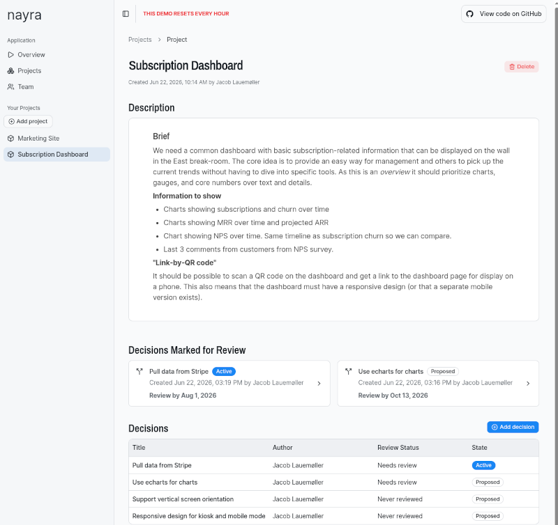
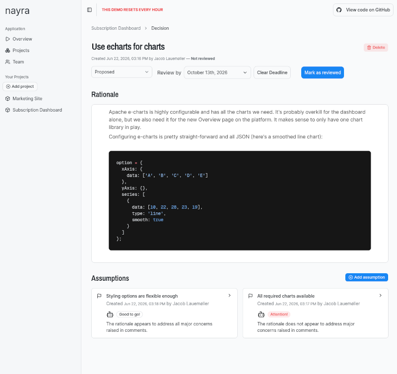
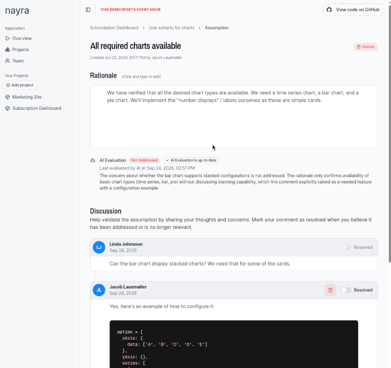

# Nayra

Nayra is a Proof-of-Concept implementation of a _Decision Journal_ for teams.

It provides teams with a simple way to record their decisions and assumptions as they work on their project. Each
decision has a rationale and a number of assumptions that it relies on. Team members can discuss these assumptions
by leaving comments, and AI is then used to evaluate whether the rationale for the assumption adequately addresases
the concerns raised. Inference runs whenever the rationale is changed, or when comments are updated, and
provides an always-current evalaution of the validity of the rationale. This can help the team spot and understand
weaknesses in the rationale and avoid false assumptions.

Decisions can be assigned a future Review-By date to help the team remember to revisit past choices. Additionally,
decision states (_proposed_, _rejected_, _active_, and _retired_) signals the current relevance of a decision,
allowing everyone to understand which are still in effect, and which purely of historical importance.







## Next steps

Turning this POC into a real product would require some additional work and features. Some are very standard
SaaS functionality such as user and profile management, invitations, and billing and payment integration. Others
are more specific to the product:

### Allow discussions of decisions

The POC only showcases a comment / discussion feature for assumptions, but a real product should also
make this available for decisions - teams will want to discuss their decisions before committing to
them. Here it would be useful to use AI to summarize the discussion thread and evaluate the
overall sentiment. Sometimes discussions run over multiple platforms -- eg. a decision may have its
roots in a discussion that took place on a related GitHub issue. It would be useful to allow
references to this discussion and use AI to summarize that part of it, then show that as background
information. See also "Integrations" below.

### Allow attachments

While the BlockNote editor used in the POC does allow images to be embedded into rationales, it would
be useful to provide a real attahcment feature where users can add eg. PDF documents as background
information. These should be included in the semantic search (see below) and it would also be useful
to use AI to summarize their contents and how they are relevant for the rationale / discussion and then
display this summary alongside the attachment. This makes it faster for team members to quickly form
an overview of the situation.

### Semantic search

The amount of decisions, assumptions, and comments will quickly run up in any serious use case and users
will need away to search across all of these. A semantic search functionality using embeddings in vector
database would provide an effective global full text search and could be made available in a top-level
search bar. However, semantic search could also be used to find and surface related decisions and assumptions
in the UI. Since most projects tend to revisit decisions about the same area of the project many times
over its lifetime, I think it would be very useful to automatically surface e.g. related decisions or
similar assumptions, and use these with AI to extract and present the essence of past decisons. As an
example, when writing the rationale for a new assumption, AI might be able to point out that a similar
assumption was discussed a year ago and found not to be sound at that time.

### Decision Quality Assurance

AI could be used to help raise decision quality by evaluating rationales for readability, comprehension,
and implicit assumptions. Another helpful evaluation would be to find past, but still active,
decisions that appear to be in conflict with the new proposed decision: this would help surface
potential problems to the team and assist in situations where the institutional knowledge of _why_
something is as it is is lost.

### API and AI tool support

As more and more development is handed over to autonomous agents, so are core decisions and assumptions.
It would be very useful to have these recorded in a decision journal for both human developers and
as part of the memory layer for agents. Adding an API to the application would enable this sort of
co-work by letting agents use skill and tools to interact with the decision journal. This would be
especially useful if the semantic search mentioned above was also exposed over the API so agents
like Claude and Codex can use the decision journal as a knowledge base when researching solutions.

### Integrations

Applications such as this are rarely used in isolation. It should integrate with platforms such
as Github and Linear for easy reference to code or issues. AI could be used to evaluate alignment
with issue descriptions, or whether assumptions about existing code appear sound and well founded.

### Decision Review

Not all decisions end up being the right ones, however much they seemed so at the time they were
made. Some was always wrong, others no longer match the product or the requirements. It would
be useful to have a more well-defined mechanism to identify and mark these, especially so that
humand developers and AI agents can more accurately determine whether a given decision still
holds or can be disregarded. Supporting this use case would require a review mechanism for
active decisions where relevant ones are picked and brought to the team's assumption. AI could
be used both for the selection process, but also for a "pre-evaluation" step where the the
agent essentially provides a review based on related, later decisions, etc.

## Purpose

The purpose of this Proof-of-Concept was to further increase my working knowledge of TypeScript, React, and Next.js
by exploring and evaluating a few ideas:

- A layered architecture for Next.js apps
- Errors as values (instead of exceptions)
- Radix-based UI component libraries
- Drizzle as the database layer
- Type-safe side-loading
- Simple, policy-based authorization

The outcome is a simple, but fully functional web application deployed in demo form [https://nayrapoc.iteray.com](https://nayrapoc.iteray.com)
-- and a significant upgrade of my Typescript, React, and Next.js knowledge.

### Layered Architecture

I wanted to experiment with how to structure a React/Next.js application and decided to partition it into four layers; going from furthest back (closest to the database) to front-end, I landed on:

- **Repositories** are responsible for low-level communication with the database library (Drizzle). They handle mapping to and from the database library schema structures and define the low-level storage API used by the service layer. Repositories form an abstraction barrier that protects the rest of the application from changes to the database library, index structures (and thus query optimization choices), and low-level constraints. The API is made up of record types (eg.`DecisionRecord`) derived automatically from the Drizzle schema using Drizzle's `InferSelectModel` template types, and CRUD functions such as `get()` or `create()`.
- **Services** encapsulate the repository layer and provides the API that the rest of the application works against. It is a relatively thin layer concerned mostly with providing a stable API, final input clean-up (such as trimming strings), and error translation (see later). Server-side components and pages use the service layer directly.
- **Actions** implements the Next.js-specific API for client-side components, handle authorization via policies, and input validation via Zod.
- **Front-end** code implements components and pages using React. Pages and server-side rendered components are responsible for performing authorization checks (using the same policies as the actions.)

**Conclusion** - The architecture worked well and helped place responsibility in the code base. It does lead to some boilerplate when new models are introduced since a corresponding model, repository, and service implementation must also be added, along with, in many cases, accompanying actions.

### Errors as Values

Rather than reaching for exceptions to signal failure, I wanted to explore modeling errors as ordinary return values so failures live in a function's type signature. Coming from Elixir, this is familiar territory: the `{:ok, value}` / `{:error, reason}` tagged tuple is the same idea, and `Result<T, E>` (here via the [neverthrow](https://github.com/supermacro/neverthrow) library, which borrows heavily from Rust ideas) is essentially its statically-typed cousin. The payoff over `throw` in TypeScript is very concrete: TypeScript has no checked exceptions, so a thrown error is invisible to the type system and a `catch` clause hands you `unknown`. A `Result` puts the error type right in the signature, and the compiler then forces every caller to deal with it.

In this example, the `update` function on `ProjectService` is typed to return `Promise<Result<Project, ProjectServiceError>>` so a caller knows it must check the result (eg. using `r.isOk()`) before using it:

```ts
export class ProjectService {
  ...

  static async update(
    projectId: string,
    input: ProjectUpdateInput,
    connection: DbConnection = db
  ): Promise<Result<Project, ProjectServiceError>> {
    const normalized = ...

    const updated = await ProjectRepository.update(projectId, normalized, connection);
    return updated.map(toProject).orElse(toProjectServiceErrorResult);
  }
  ...
}
```

A key design decision was _which_ failures deserve this treatment. Turning genuine unexpected bugs into values means you have to thread error handling through every call site and in most cases end up with a generic handler at the top of the call stack. That just adds noise, so the project draws a line:

- **Expected failures** that occur through normal use of the UI, like a duplicate email or an empty required field, are returned as the error type `err(...)`. The caller is expected to handle these and map them back to a form field so the user can fix their mistake.
- **Unexpected failures** such as foreign-key violations, broken invariants, or anything else that signals a bug, still `throw` an exception. They should surface loudly rather than be quietly threaded through the happy path as there is no recourse for the user.

Errors change shape as they cross layer boundaries, getting a little more domain-aware at each step:

- **Repositories** wrap database writes in a `guarded()` function, which converts _only_ the constraint violations pre-registered via a handler (eg. `unique(...)` or `notNull(...)`) into a typed `RecordError`; everything else re-throws.
- **Services** map that to a `ServiceError` keyed on the domain model, typically by chaining: `result.map(toModel).orElse(toServiceErrorResult)`. The `map`/`orElse` style is sometimes called _railway-oriented programming_ as the happy path and the error path run on parallel tracks and you compose along whichever one you're on, without manual `if (!r.ok())` checks at every step.
- **Actions** convert the `Result` into a plain `ActionResult` object (`{ success, data } | { success, error }`) so it can cross the server/client boundary into an HTML form, since a `Result` instance can't be serialized over the wire.

Transactions fit the same model: the `transactionResult` wrapper function initiates rolls back automatically when its callback returns an `err(...)`, so a returned error and a database rollback are the same event.

**Conclusion** - Errors-as-values worked well and the type system genuinely earned its keep. Refactors that changed a failure mode showed up as compile errors at exactly the call sites that needed updating. The discipline of explicitly classifying each failure as expected or unexpected was the valuable part; neverthrow's combinators made the chaining ergonomic, though the `Result` to `ActionResult` conversion at the server/client boundary is a reminder that the pattern stops at the edges of the type-safe world.

One complication I ran into during implementation was mapping from database-level column names to TypeScript / domain-level names in `toServiceErrorReuslt`: my database schema uses traditional snake-case such as `account_id` but the rest of the code expects camel-cased names. Errors originating in the database (such as as a NOT NULL error) carries the snake-cased name and this needs to be converted to it's corresponding camel-cased counterpart in order to fit into the form error reporting. Rather than forcing one domain to use a "foreign" naming convention, handwriting conversion functions, or escaping through untyped strings, I solved it using a template literal type which computes the camel-cased field type at compile time, ensuring type safety. This does rely on the convention that a snake-cased name in the database should _always_ be mapped to it's camel-case version, but that seems reasonable:

```ts
type SnakeToCamel<S extends string> =
  S extends `${infer Head}_${infer Tail}` ? `${Head}${Capitalize<SnakeToCamel<Tail>>}` : S;

function camelizeKey<T extends string>(key: T): SnakeToCamel<T> {
  return key.replace(/_(\w)/g, (_, c: string) => c.toUpperCase()) as SnakeToCamel<T>;
}
```

Finally, I had to take care to ensure that any `err(...)` returned from a transaction ultimately leave as an exception as Drizzle won't initiate a database roll back otherwise. This is handled by the function `awaitTransactionResult` which starts and encapsulates the Drizzle transaction and converts from result, to exception, and back again.

### UI Components

I wanted to explore building a React UI based on the popular [shadcn](https://ui.shadcn.com/) components and see how easy it would be to adopt additional Radix-based components. I picked [DiceUI](https://diceui.com/) as the secondary library because it offers a range of useful components, is well-documented, and fits well with shadcn. I also included [BlockNote](https://www.blocknotejs.org/) as the editor for project descriptions, decision rationales, etc. This component is React-ready but not part of the Radix family. It provides sophisticated Notion-like documents that significantly enrich the UI and project utility.

**Conclusion** - Building with these libraries was extremely easy, and the range of components they offer serves most common needs. I am mostly constrained by my limited design skills. It would be nice to have more application-skeleton level components (blocks) but these are either available as commercial blocks or can be built by hand by composing the lower-level components. Styling with Tailwind CSS was straightforward. Documentation is excellent.

Both shadcn and Dice vendor their components into the source tree; this is both a blessing and a curse: because the code is vendored you can tweak it to your needs, but in doing so you run the risk of complicating the addition of future components, if they rely on later versions of your tweaked components. Another issue I ran into a few times was that shadcn doesn't specify which version of Radix its components expect and on a few occasions these came out of lock step and required manual intervention. This would typically happen when a component added early in the project implicitly depended on a version of a Radix component that was then updated by a later addition. It wasn't a big issue, but something to be aware of.

### Drizzle as the Database Layer

In my experience, many high-level ORMs do too much in an effort to appear magical and easy to use. They pave over the very real differences between the object-oriented paradigm and the relational one. In doing so they make it hard to write queries that take advantage of the database's query engine, skew database design, and inadvertently invite n+1 loads through "magic" side-loading of references. I prefer a thinner layer that provides more direct control and leaves it up to the application to map between the two paradigms. In this project I chose [Drizzle](https://orm.drizzle.team/) which fits very well with this philosophy; while it does provide a degree of high-level query building it doesn't "hide the machine" and offers good support for hand-written joins at the DSL level.

**Conclusion** - Drizzle worked very well and was easy to learn. It doesn't support some advanced PostgreSQL syntax, but this can be alleviated using the `sql` "macro". Documentation is fair and I didn't feel like I had to fight the library.

### Type-safe Side-loading

One of the great promises of statically typed languages is that you can leverage the type system to prevent whole classes of logical errors. In this project, I wanted to explore ways to let functions and components signal what side-loaded information they require through their type signatures. As an example, a component that displays a `Decision` along with creator information would also need the corresponding creator (a `User` record). There are several ways to solve this; sometimes the caller performs two loads, sometimes the component issue an extra load for the additional information required, and sometimes specialized loading functions load all information at once. The latter is usually necessary if the information is displayed in bulk.

The solution explored here is to introduce _loading contexts_ which allow type-level specification of required side-loads. In the `Decision` example, the UI component would specify the type of its `decision` prop to be `Decision<"with-creator">` rather than just `Decision`. With this approach the component expresses the exact data it needs through its prop types, enforcing the caller to perform the required side-loading to obtain a component of the correct type. It can then do so in the most performant way according to how the component is used. As an added bonus, this also facilitates a much improved developer experience since the language server can show both the required side-loads (at the caller side) and the available side-loaded data (at the consumer side).

The example below shows two getters on the `DecisionService`. One returns a plain `Decision` with no side-loads, the other includes `Creator` information:

```ts
export class DecisionService {
  // ...

  static async get(decisionId: string, connection: DbConnection = db): Promise<Decision | undefined> {
    const record = await DecisionRepository.get(decisionId, connection);
    return toDecisionIfAny(record);
  }

  static async getWithCreator(
    decisionId: string,
    connection: DbConnection = db
  ): Promise<Decision<"with-creator"> | undefined> {
    const record = await DecisionRepository.getWithCreator(decisionId, connection);
    return toDecisionWithCreatorIfAny(record);
  }

  static async listWithCreatorForProject(
    projectId: string,
    connection: DbConnection = db
  ): Promise<Decision<"with-creator">[]> {
    const records = await DecisionRepository.listWithCreatorForProject(projectId, connection);
    return records.map(toDecisionWithCreator);
  }
  // ...
}
```

This is based on the model level type definitions

```ts
type LoadingContext = "basic" | "with-project" | "with-creator" | "with-project-and-creator";

type LoadedFields<T extends LoadingContext> =
  T extends "with-project" ? { project: Project }
  : T extends "with-creator" ? { creator: User }
  : T extends "with-project-and-creator" ? { project: Project; creator: User }
  : // eslint-disable-next-line @typescript-eslint/no-empty-object-type
    {};

export type Decision<T extends LoadingContext = "basic"> = z.infer<typeof decisionSchema> & LoadedFields<T>;
```

It follows that a `Decision<"with-creator">` simply has an extra `creator` field which contains the side-loaded account data. The repository can then fetch the desired side-loads all at once, if needed:

```ts
class DecisionRepository {
  // ...
  static async listWithCreatorForProject(
    projectId: string,
    connection: DbConnection = db
  ): Promise<DecisionWithCreatorResult[]> {
    return await connection
      .select({
        decision: decisions,
        creator: users
      })
      .from(decisions)
      .innerJoin(users, eq(users.id, decisions.creator_id))
      .where(eq(decisions.project_id, projectId))
      .orderBy(asc(decisions.created_at));
  }
}
```

**Conclusion** - The idea worked quite well and the type-based loading contexts made it very easy to understand the data needs of components, and made refactoring easier. The current implementation naturally leads to a plethora of loading contexts as combinations of side-loaded types grow, and it is worth exploring if the mechanism can be implemented in a different way.

### Policy-based Authorization

I wanted to explore a simple policy-based authorization mechanism where policies related to specific model objects (eg. "user can create new projects") are co-located in a simple policy file which exports them as pure and easily tested functions:

```ts
export function canCreateProject(actor: SessionUser, accountId: string): boolean {
  return isTenant(actor, accountId) && hasRole(actor, ["admin", "owner"]);
}
```

I have used something similar on other projects and have found it to be simple to work with, and understand.

**Conclusion** - The model worked well for the project and was easy to use with Next.js.

### Authentication

Authentication uses **NextAuth v4** with JWT sessions (no server-side sessions table). Login is passwordless: the user enters their email, NextAuth sends a magic link, and clicking it establishes the session.

A few notable observations:

- A **custom adapter** maps NextAuth onto the existing `users` and `verification_tokens` tables, since the schema (deliberately) doesn't match NextAuth's expected shape.
- The auth config is built by a **lazy `getAuthOptions()` function** rather than a module-level constant, so environment variables and the DB connection aren't evaluated at import time. This is important because Next.js evaluates module-level code during build and we want these variables to be injected via the runtime environment in the cloud.
- The **signup/claim flow** creates the account and user in a single transaction, then drives the user through email verification. A `claimed_at` timestamp records that the user both owns the email and intended to create the account, which keeps the door open for garbage-collecting abandoned signups later.
- Route protection lives in `src/proxy.ts` (Next.js 16's replacement for `middleware.ts`), which redirects unauthenticated requests to `/login`.

**Conclusion** - NextAuth v4 covered the magic-link flow well, but bending it onto a pre-existing schema took a custom adapter and some care around lazy initialization to keep build and CLI scripts from tripping over missing env vars.

### AI Disclosure

Claude Code was used as a paring partner throughout the project, and provided assistance with concrete TypeScript or Next.js difficulties and test implementation. I instructed Claude to behave as a mentor and gave it an honest characterization of my current TypeScript and Next.js experience. To help it draw upon my existing knowledge when explaining concepts, I told it about my significant experience from other platforms such as Elixir, Ruby, and JavaScript.

Claude wrote most of the utility scripts for dumping and loading the demo database, deploying the demo using Docker, and the code for uploading files to object storage, as these were all considered out of scope for project. I also used Claude to bounce architecture ideas around and for code review wrt. idiomatic Next.js use.

**Conclusion** - Framing Claude as a pairing partner rather than a "coding agent" proved a significant enabler. I felt like I was in the driver's seat and _learned_ rather than _observed_. This, to me, is the difference between _AI assisted_ and _AI driven_ development and was very enjoyable. I would not have been able to go from idea to final POC in just a few weeks without the ability to ask deep questions about TypeScript's type system or Next.js and would instead have spent much more time trawling through online documentation.

### Data Model

- An `Account` (team) has many `Users` and `Projects`
- Every `Project` has a creator (`User`) who initiated the project.
- A `Project` has zero or more `Decisions`, each created by a `User`.
- A `Decision` has zero or more `Assumptions`, each created by a User. Decisions can be given a review-by date and has a state that indicates its current standing (_proposed_, _rejected_, _active_, _retired_)

### Prerequisites

- Node.js 20.9+ (`.tool-versions` pins the version used in development)
- pnpm
- PostgreSQL running locally
- Docker (for Minio object storage and Mailpit email capture)

## Getting Started

### 1. Install dependencies

```bash
pnpm install
```

### 2. Configure environment

```bash
cp .env.example .env.development.local
cp .env.example .env.test.local
```

Edit each file with the appropriate values:

- `DATABASE_URL` — `postgres://localhost:5432/nayra_dev` (or `nayra_test` for test)
- `NEXTAUTH_SECRET` — generate with `openssl rand -base64 32`
- `NEXTAUTH_URL` — `http://localhost:3000`
- `OBJECT_STORAGE_*` — for the local Minio from step 3: endpoint `http://localhost:9000`, bucket `nayra-dev` (or `nayra-test` for test), credentials matching `MINIO_ROOT_USER` / `MINIO_ROOT_PASSWORD`
- `EMAIL_SERVER_*` — for the local Mailpit from step 5: host `localhost`, port `1025`, any non-empty user/password
- `EMAIL_FROM` — sender address for magic-link emails (the example default is fine locally)
- `ANTHROPIC_API_KEY` — used by the background job that evaluates assumption rationales. Only needed in the dev file; the tests stub the model. Without it the app runs, but evaluation jobs fail

### 3. Set up object storage (Minio)

Image uploads (and the storage integration tests) need an S3-compatible store. Run Minio locally:

```bash
docker run -d --name minio -p 9000:9000 -p 9001:9001 \
  -e MINIO_ROOT_USER=admin -e MINIO_ROOT_PASSWORD=12345678 \
  minio/minio server /data --console-address ":9001"
```

Create the dev and test buckets and allow anonymous downloads (uploaded images are served via public URLs):

```bash
docker exec minio sh -c '
  mc alias set local http://localhost:9000 admin 12345678 &&
  mc mb local/nayra-dev local/nayra-test &&
  mc anonymous set download local/nayra-dev &&
  mc anonymous set download local/nayra-test'
```

The Minio console is available at [http://localhost:9001](http://localhost:9001).

### 4. Set up the databases

```bash
pnpm db:dev:setup   # creates nayra_dev, runs migrations, seeds data
pnpm db:test:setup  # creates nayra_test, runs migrations, seeds data
```

Optionally, load the demo data from `db-dump.json` into the dev DB (destructive: truncates the domain tables first):

```bash
pnpm db:load
```

### 5. Set up local email capture (Mailpit)

Login uses magic-link emails, so the dev server needs an SMTP endpoint. Mailpit captures outgoing mail without real delivery:

```bash
docker run -d --rm --name mailpit -p 1025:1025 -p 8025:8025 axllent/mailpit
```

View captured mail at [http://localhost:8025](http://localhost:8025).

### 6. Start the development server

```bash
pnpm dev
```

Open [http://localhost:3000](http://localhost:3000).

## Running Tests

Tests require a running PostgreSQL instance with `nayra_test` set up (step 4) and Minio with the `nayra-test` bucket (step 3) — the storage integration tests skip themselves if `OBJECT_STORAGE_*` is unset, but fail if it points at a missing bucket.

```bash
pnpm test:run          # run all tests once
pnpm vitest run <path> # run a single test file
pnpm test              # run in watch mode
```

## Common Commands

```bash
pnpm build        # Build for production
pnpm lint         # Run ESLint
pnpm typecheck    # tsc --noEmit

pnpm db:generate  # Generate SQL migrations from schema changes
pnpm db:migrate   # Apply pending migrations to dev DB
pnpm db:studio    # Open Drizzle Studio (visual DB browser)
```
